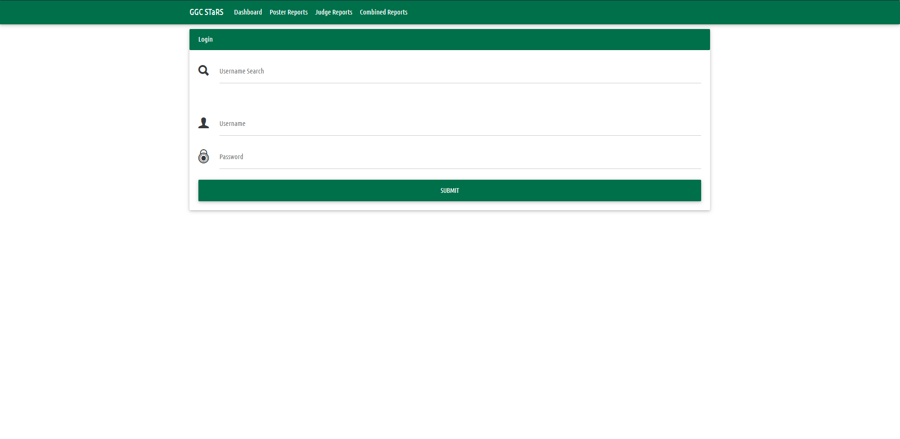
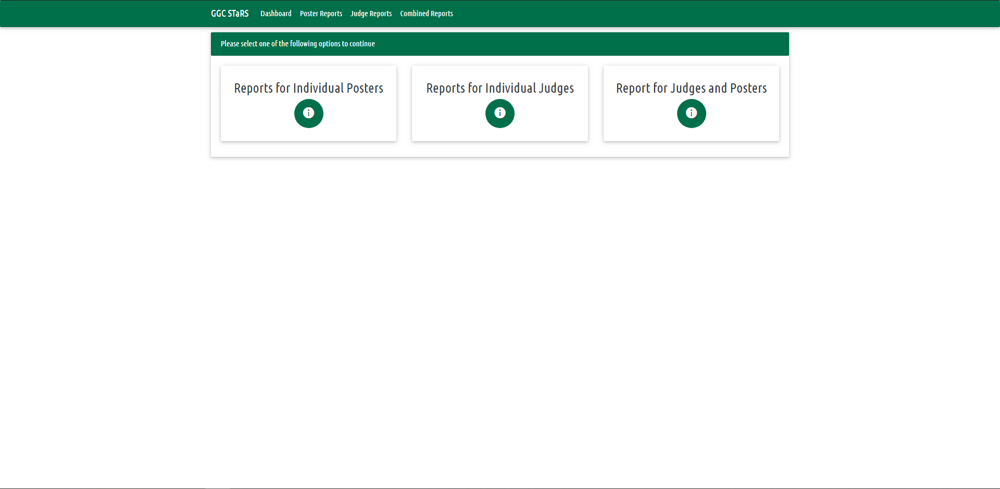
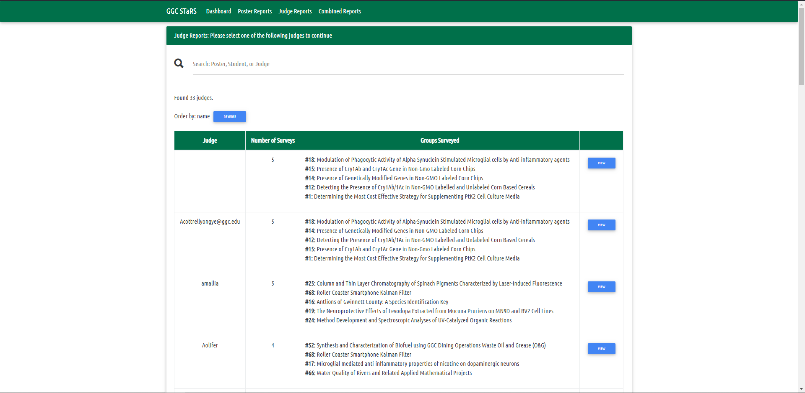

# STaRS-Web

A web client to support the STaRS mobile application. Used to analyze results from judging.

## Team

* Team Polaris - Fall 2019

## Repo Location URL

* https://github.com/soft-eng-practicum/STaRS

## Progess tracking tool

* TBA

## Communication tool

* [Discord](https://discordapp.com/)

## Members

1.
2. **Juan Linares**: *Lead Programmer & Testing Lead* :ghost:
3.
4.

## Installation

1. `npm` is required to install dependencies and run
1. Clone repository
1. Navigate to folder location in a terminal
1. Run `npm i` to install dependencies

## How to Run

* Navigate to folder location in a terminal
* Run `npm start`
* Open `localhost:3197` in a browser to view app locally

## Functionality

* Poster report details can be exported to PDF or CSV

### Login

### Dashboard

### Poster Reports

### Judge Reports

### Combined Reports

