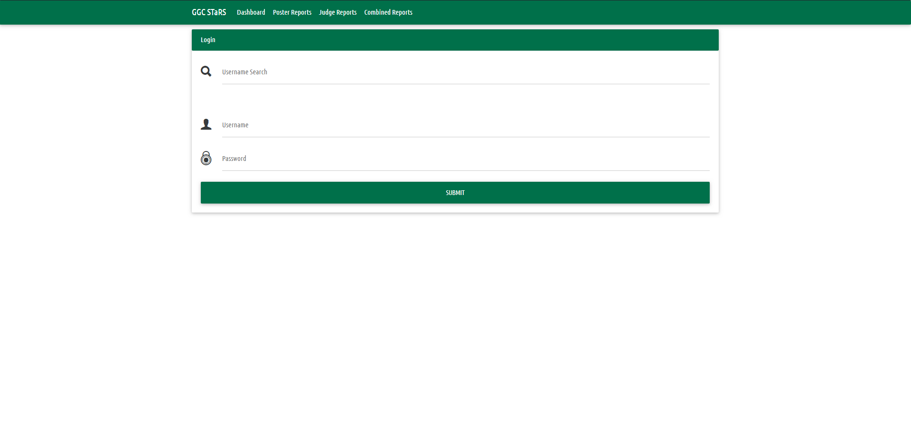
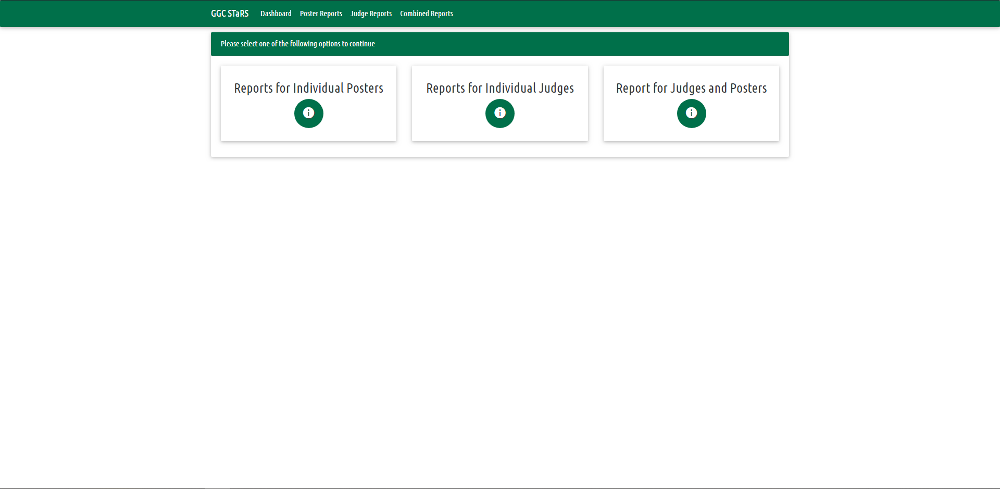
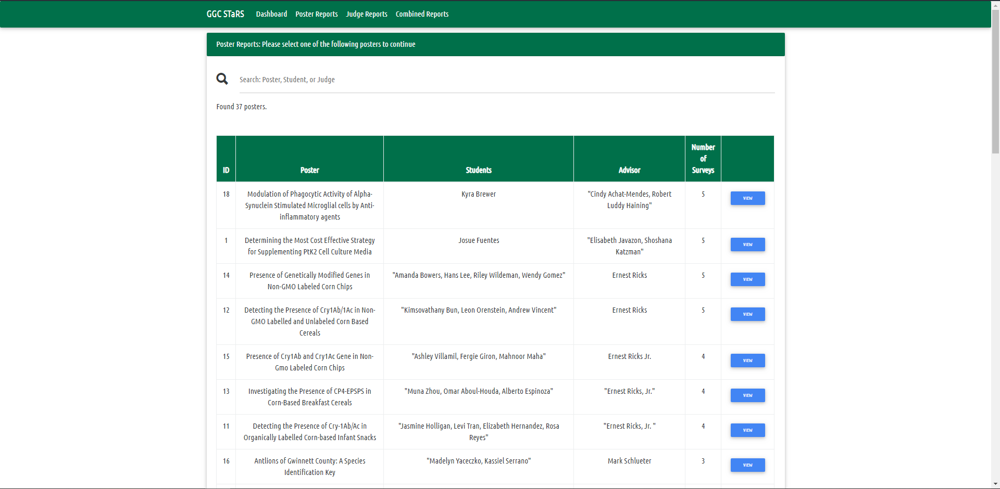
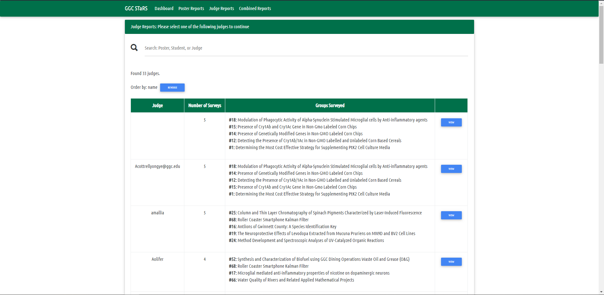
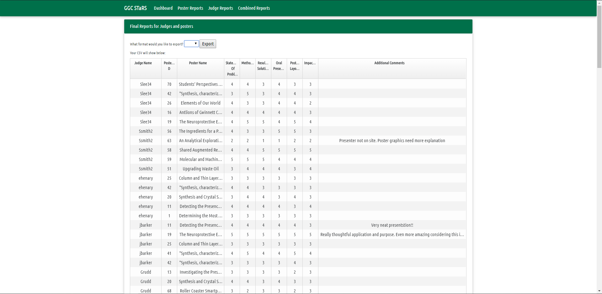

# STaRS-Web

A web client to support the STaRS mobile application. Used to analyze and export results from judging events.

---

## Team

* **Team Polaris** - Fall 2019
1. **Nancy Sardar** — *Project Manager & Client Liaison* :zap:
2. **Juan Linares** — *Lead Programmer & Testing Lead* :ghost:
3. **Andrew Plourde** — *Documentation & Data Modeler* :thought_balloon:
4. **Jacob Weekley** — *UI/UX Designer & Lead Programmer* :ice_hockey:

* **Internship** - Fall 2025
1. **David Flores** — *Developer* :rocket:

---

## Repository Location

**GitHub:**  
🔗 https://github.com/soft-eng-practicum/STaRS

---

## Progress Tracking

*To be announced.*

---

## Communication Tool

* [Discord](https://discordapp.com/)

---

## Installation

### Prerequisites
- Node.js (v18+ recommended)
- npm 
- Angular CLI globally installed

---

### Steps

#### Frontend
1. Clone the repository:
   ~~~bash
   git clone https://github.com/soft-eng-practicum/STaRS.git
   ~~~
2. Navigate into the project folder:
   ~~~bash
   cd STaRS-AdminPanel
   ~~~
3. Install dependencies:
   ~~~bash
   npm install
   ~~~

#### Backend (Email Service)
1. Navigate into the \`server\` folder:
   ~~~bash
   cd server
   ~~~
2. Install backend dependencies:
   ~~~bash
   npm install
   ~~~

---

## How to Run

### Run the Angular Frontend
1. From the root folder:
   ~~~bash
   npm start
   ~~~
2. Open your browser and go to:  
    http://localhost:4200

### Run the Node Backend (Email Service)
1. From the \`server\` folder:
   ~~~bash
   npm run start
   ~~~
2. The backend runs at:  
    http://localhost:3000

---

## Environment Configuration (Backend)

Create a **\`.env\`** file inside the **/server** folder:
* If Brevo account:
~~~bash
BREVO_SERVER=smtp-relay.brevo.com
BREVO_PORT=587
BREVO_USER=user@email
BREVO_PASS=your_brevo_password
BREVO_FROM="STARS Judging Support <your@email>"

~~~
## Environment Configuration (Frontend)

Create a **\`environment.ts\`** file inside the **/src/app/environments** folder:

~~~bash
export const environment = {
  production: false,

  couch: {
    protocol: 'connection string protocol',
    host: 'host',
    port: 'port',
    username: '', // left blank; filled in after login
    password: '', // left blank; filled in after login

    judgesDB: 'DBname',
    confDB: 'DBname',
  },

  configurationDocId: 'DBname'
};

~~~

---

## Functionality

- Poster report details can be exported to **CSV** (PDF optional later)
- Judge survey results can be reviewed, sorted, and exported
- Combined report shows all judging data in one place
- **Email service** allows sending judging feedback directly to students and advisors

---

## Security Notes

- Credentials are stored in \`.env\` only (never in frontend code)
- CORS enabled for \`http://localhost:4200\`
- SMTP connection uses TLS

---

## Screenshots

### Login

### Dashboard

### Poster Reports

### Judge Reports

### Combined Reports

`;
